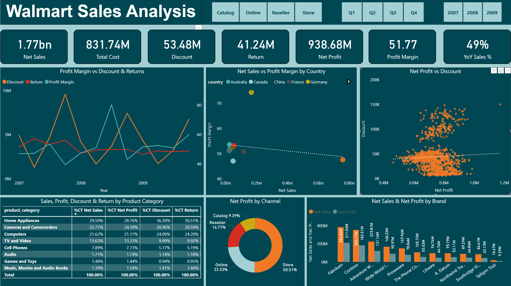

# WalMart Sales Analytics Project

**This project explores sales and profitability in the retail and e-commerce sector. The company has enjoyed steady sales growth, but profit margins have not kept pace. Management is particularly concerned about the impact of product returns, aggressive discounting, and uneven regional performance. Our analysis takes a closer look at these challenges by breaking down profitability across products, geographies, and sales channels, while also examining trends over time. The findings highlight where revenue is leaking and provide practical recommendations the business can act on to strengthen margins and support sustainable growth.**

# Table of Contents

+ [Project Objective](#project-objective)
+ [Project Files](#project-files)
  - [1. Data Files](#1-data-files)
  - [2. Scripts & Notebooks](#2-scripts--notebooks)
  - [3. Reports](#3-reports)
+ [Tools and Technologies](#tools-and-technologies)
+ [Setup & Installation](#setup--installation)
+ [Project Workflow](#project-workflow)
  - [1. Database Creation](#1-database-creation)
  - [2. ETL Process](#2-etl-process)
  - [3. Exploratory Data Analysis (EDA)](#3-exploratory-data-analysis-eda)
  - [4. Visualization & Dashboards](#4-visualization--dashboards)
  - [5. Reporting](#5-reporting)
+ [Analysis Summary & Key Insights](#analysis-summary--key-insights)
  - [1. Seasonal Trends](#1-seasonal-trends)
  - [2. Categorical Data Insights](#2-categorical-data-insights)
  - [3. Visual Insights](#3-visual-insights)
+ [Project Structure](#project-structure)
+ [Contributing](#contributing)
+ [License](#license)
+ [Author](#author)

# Project Objective

The project aims to:

+ Analyze sales and profitability drivers across product categories, brands, and channels.

+ Evaluate the financial impact of returns and discounts on net sales and net profit.

+ Compare regional and geographical performance to highlight markets with high sales but low profitability.

+ Identify trends and seasonality in sales and profit margins across years and quarters.

+ Highlight actionable insights and recommendations to improve overall profitability.

# Project Files

The project files are as follows :

## 1. Data Files

### Fact Tables
+ `data/raw/sales.csv` – Sales Transactions Table

### Dimension Tables
+ `data/raw/calendar.csv` – Dates Table
+ `data/raw/channel.csv` – Sales Channel Table
+ `data/raw/geography.csv` – Country and Continent Table
+ `data/raw/product_sub_category.csv` – Product Sub-Category Table
+ `data/raw/products.csv` – Product Details Table

## 2. Scripts & Notebooks

+ `sql/create_db_load_data.sql` – SQL script to create database and load tables
+ `scripts/db_sql_etl_process.py` – full ETL pipline
+ `notebooks/01_db_etl_execute.ipynb` – Notebook to execute ETL process and generate consolidated **sales summary** table.
+ `notebooks/02_exploratory_data_analysis.ipynb` – Performs Exploratory Data Analysis

## 3. Reports

### Dashboards
+ `reports/dashboards/walmart_sales_analysis_dashboard.pbix` – Power BI dashboard
### Figures
+ `reports/figures/` – Plots and visualizations, e.g., correlation plots, profit analysis, distributions
### Summary Reports
+ `reports/summary_reports/walmart_sales_analytics_report.pdf` – Detailed analysis report

# Tools and Technologies

| **Tool/Library**    |   **Purpose**                                |
|--------------------|-----------------------------------------------|
| **Python**          | Core programming language for data analysis. |
| **NumPy**           | Numerical computations and array operations.  |
| **Pandas**          | Data manipulation and preprocessing.          |
| **Matplotlib**      | Data visualization with static plots.         |
| **Seaborn**         | Statistical data visualization.                |
| **SciPy**           | Scientific computing and advanced statistics. |
| **SQLAlchemy**      | SQL toolkit and ORM for database interaction. |
| **PyMySQL**         | MySQL database connector for Python.          |
| **MySQL**           | Relational database management system.        |
| **Power BI**        | Dashboard creation and business reporting.     |
| **Jupyter Notebook**| Interactive coding and presentation environment. |
| **VS Code**         | Integrated development environment (IDE).     |
| **Markdown**        | Documentation and README formatting.           |

# Setup & Installation

Follow these steps to set up the project locally:

## 1. Clone the Repository
```bash
git clone https://github.com/hemant4dsci/walmart_sales_analysis.git
```

## 2. Create a virtual enviroment
```bash
# For Windows
python -m venv venv
venv\Scripts\activate

# For macOS/Linux
python3 -m venv venv
source venv/bin/activate
```

## 3. Install Dependencies
```bash
pip install -r requirements.txt
```

# Project Workflow

The project workflow is organized into the following steps:

## 1. Database Creation
+ Execute `sql/create_db_load_data.sql` in MySQL Workbench.  
+ This script creates the database schema and loads all **fact** and **dimension** tables:  
    - `sales.csv` (Fact table)  
    - `calendar.csv`, `channel.csv`, `geography.csv`, `product_sub_category.csv`, `products.csv` (Dimension tables)  

## 2. ETL Process
+ The script extracts raw data, loads it into the database, and applies transformations to prepare structured table.  
+ For interactive execution, open `notebooks/01_db_etl_execute.ipynb` and **execute every cell in order**:
    - One of the notebook cells imports and calls a custom function from `scripts/db_sql_etl_process.py` which runs the entire ETL pipeline and creates the consolidated **sales summary** table.
    - Code of that cell
  
    ```python
    import sys

    sys.path.append("../scripts")
    from db_sql_etl_process import create_sales_summary

    create_sales_summary(engine)
    ```

    - SQL query to extract data from fact and dimensions tables.

    ```sql
    WITH sales_summary AS(
        SELECT
            dates,
            channel_key,
            product_key,
            geo_key,
            product_sub_category_key,
            MIN(unit_cost) AS unit_cost,
            MIN(unit_price) AS unit_price,
            SUM(sales_quantity) AS sales_quantity,
            SUM(return_amount) AS return_amount,
            SUM(discount_amount) AS discount_amount
        FROM
            sales
        GROUP BY 
            dates,
            channel_key,
            product_key,
            geo_key,
            product_sub_category_key
    )
    SELECT
        ss.dates,
        ch.channel_name AS channel,
        pd.brand_name AS brand,
        psc.product_category_name AS product_category,
        gg.country_name AS country,
        MIN(ss.unit_cost) AS unit_cost,
        MIN(ss.unit_price) AS unit_price,
        SUM(ss.sales_quantity) AS sales_quantity,
        SUM(ss.return_amount) AS return_amount,
        SUM(ss.discount_amount) AS discount_amount
    FROM
        sales_summary ss
        LEFT JOIN channels ch
            ON ss.channel_key = ch.channel_key
        LEFT JOIN products pd
            ON ss.product_key = pd.product_key
        LEFT JOIN geography gg
            ON ss.geo_key = gg.geo_key
        LEFT JOIN product_sub_category psc
            ON ss.product_sub_category_key = psc.product_sub_category_key
    GROUP BY
        ss.dates,
        ch.channel_name,
        pd.brand_name,
        psc.product_category_name,
        gg.country_name;
    ```

    - Python code for creating sales summary table in data-base.

    ```python
    from sqlalchemy import Column, INTEGER, NUMERIC, VARCHAR, DATE
    from sqlalchemy.orm import declarative_base

    # Base class for ORM
    Base = declarative_base()

    # Defining table as a class
    class SalesSummary(Base):
        __tablename__ = "sales_summary"

        # Columns
        id = Column(INTEGER, primary_key=True, autoincrement=True)  # Primary key
        dates = Column(DATE)
        channel = Column(VARCHAR(255))
        brand = Column(VARCHAR(255))
        product_category = Column(VARCHAR(255))
        country = Column(VARCHAR(255))
        return_amount = Column(NUMERIC(10, 2))
        discount_amount = Column(NUMERIC(10, 2))
        total_cost = Column(NUMERIC(15, 2))
        total_sales = Column(NUMERIC(15, 2))
        net_sales = Column(NUMERIC(15, 2))
        net_profit = Column(NUMERIC(15, 2))
        profit_margin = Column(NUMERIC(10, 2))


    Base.metadata.drop_all(engine)  # Drop old table if exist
    Base.metadata.create_all(engine)  # Create new table
    ```
+ After execution of ETL, Database Tables relations :
    

## 3. Exploratory Data Analysis (EDA)  
- Open and run each cell of `notebooks/02_exploratory_data_analysis.ipynb` step by step to explore the cleaned and transformed data.  
- The notebook provides a detailed investigation of sales and profitability patterns through:  

### Summary Statistics
- Key metrics for **Sales, Net Sales, Returns, Discounts, Cost, Net Profit, and Profit Margin**.  
- Example visualization:  


### Univariate Analysis
- Distribution of **Returns, Discounts, Cost, Net Sales, Net Profit, and Profit Margin** using histograms.  
- Identification of the **most frequent Product Categories and Brands**.

### Bivariate Analysis
- **Correlation analysis** – quantifies relationships between sales, returns, discounts, and profitability.  
    
- **Sales channel profitability analysis** – identifies which **sales channels** generate the highest **profit and margins**.  
- **Product Category Contribution Analysis** – evaluates the percentage contribution of each **Product Category** to overall metrics.  
- **Impact of discounts and returns on profitability** – analyzes how **discount amounts** and **return amounts** affect overall **profit and margins**.  
- **Sales vs Profit Margin across all countries** – compares revenue and profitability performance across different geographies.

### Time-Series Analysis 
- **Impact of returns and discounts on sales over time** – analyzes how **return amounts** and **discount amounts** influence **sales trends**.  
- **Profit margin trends over time** – tracks whether **profit margins** are improving or declining.  
- Example visualization:  
  

### Hypothesis Testing
- **Profit margin variation across countries** – ANOVA test was performed to determine if **profit margins significantly differ among countries**.  
  - **Result:** There is **no significant difference** in profit margins among countries.  
  - **Interpretation:** Since the **p-value is greater than the significance level (α)**, we **fail to reject the null hypothesis**, indicating that profit margins are statistically similar across countries.


> For a summary of actionable insights derived from this analysis, see the **Analysis Summary & Key Insights** section below.

## 4. Visualization & Dashboards 

### Visualizations
+ All visualizations generated during the EDA are saved in:  
    - `reports/figures/`
+ These include summary statistics plots, histograms, correlation and bivariate plots, time-series trends, and discount/return impact visualizations.

### Dashboard
+ Use Power BI dashboard (`reports/dashboards/walmart_sales_analysis_dashboard.pbix`) to visualize insights.  
+ Covers sales trends, profitability, country-level performance, and channel comparisons.


   
## 5. Reporting 

- The final report, including all visuals and detailed analysis, is documented in `reports/summary_reports/walmart_sales_analytics_report.pdf`.  
- Visuals and plots are included to support insights and recommendations.

# Analysis Summary & Key Insights

The analysis provides a comprehensive understanding of sales, profitability, and business performance based on the Walmart dataset.

## 1. Seasonal Trends
- **Quarterly and Yearly Sales Patterns:**  
  - Sales show clear seasonal fluctuations throughout the year.  
  - Returns and discounts have a measurable impact on sales volume over time.

- **Profitability Over Time:**  
  - Overall profit margins are generally consistent across periods.  
  - Discounts and returns negatively affect net profit, with varying impact by product category.

- **Holiday Season Impact:**  
  - During the holiday season, profit margins decline rapidly, indicating the need for strategic discounting, promotions, and inventory planning.

## 2. Categorical Data Insights
- **Country-Level Performance:**  
  - Profit margins are statistically similar across countries (ANOVA test, p-value > α).  
  - The **United States** has the highest sales volume but exhibits the lowest profit margin (50.9%), highlighting potential cost or discount management opportunities.

- **Sales Channel Performance:**  
  - The **Store channel** drives more than **50% of total profit**, making it the most profitable channel.  
  - The **Catalog channel** underperforms, highlighting opportunities to improve efficiency or optimize marketing strategies.

- **Product & Category Insights:**  
  - **Home Appliances** leads in sales (29.5%) but also has high returns (36.6%), possibly due to **quality issues or return policy abuse**.  
  - Monitoring key categories helps optimize inventory and promotions.

- **Brand Performance:**  
  - Certain brands generate the most sales and profit, guiding focus for inventory planning and marketing.

## 3. Visual Insights
- Interactive dashboards and visualizations were created in **Power BI** to explore:  
  - Seasonal sales and profitability trends across countries.  
  - Channel performance and product/category contributions.  
  - Impact of discounts and returns on profitability over time.

> For full detailed analysis and visualizations, refer to `reports/summary_reports/walmart_sales_analytics_report.pdf`.

# Project Structure

```bash
walmart_sales_analysis/
│
├─ data/                        # Datasets (raw, interim, final)
│  ├─ final/                    # Final processed data
│  ├─ interim/                  # Intermediate cleaned data
│  └─ raw/                      # Raw data sources
│     ├─ calendar.csv                       # Dates table
│     ├─ channel.csv                        # Sales channel table
│     ├─ geography.csv                      # Country & continent table
│     ├─ product_sub_category.csv           # Product sub-category table
│     ├─ products.csv                       # Product details table
│     └─ sales.csv                          # Sales transactions (Fact table)
│
├─ logs/                        # Log files for pipeline runs
│
├─ notebooks/                   # Jupyter notebooks
│  ├─ 01_db_etl_execute.ipynb               # ETL process execute
│  └─ 02_exploratory_data_analysis.ipynb    # Exploratory data analysis
│
├─ reports/
│  ├─ dashboards/                           # Power BI dashboards
│  │  └─ walmart_sales_analysis_dashboard.pbix
│  ├─ figures/                              # Visualizations & plots
│  │  ├─ after_etl_db_table_relation.png                         
│  │  ├─ correlation_plot.png
│  │  ├─ dashboard_preview.png
│  │  ├─ discount_return_impact_profit.png
│  │  ├─ distribution_numeric_column.png
│  │  ├─ frequent_category.png
│  │  ├─ margin_distribution_country.png
│  │  ├─ profit_channel.png
│  │  ├─ qtr_profit_margin.png
│  │  ├─ qtr_sales_return_discount.png
│  │  ├─ revenue_margin_country.png
│  │  ├─ sales_profit_brand.png
│  │  ├─ sales_profit_discount_returns_product_category.png
│  │  └─ summary_stats.png
│  └─ summary_reports/          # PDF reports
│     └─ walmart_sales_analytics_report.pdf
│
├─ scripts/                     # Python scripts
│  └─ db_sql_etl_process.py                 # SQL ETL pipeline
│
├─ sql/                         # SQL schema & data load
│  └─ create_db_load_data.sql               # Create database and load tables
│
├─ .gitattributes
├─ .gitignore
├─ LICENCE
├─ README.md
└─ requirements.txt             # Python dependencies

```

# Contributing

Contributions are welcome! Please fork the repository and submit a pull request.


# License

This project is licensed under the MIT License.


# Author

Hi, I'm Hemant, a data enthusiast passionate about turning raw data into meaningful business insights.

**Let’s connect:**
- LinkedIn : [LinkedIn Profile](https://www.linkedin.com/in/hemant1491/)  
- Email : hemant4dsci@gmail.com
